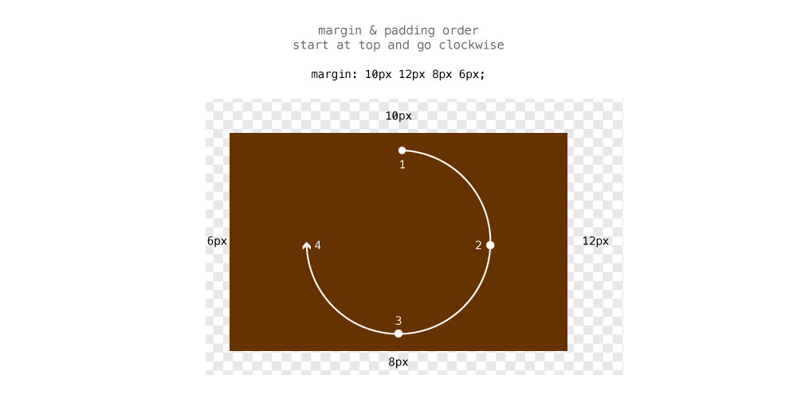
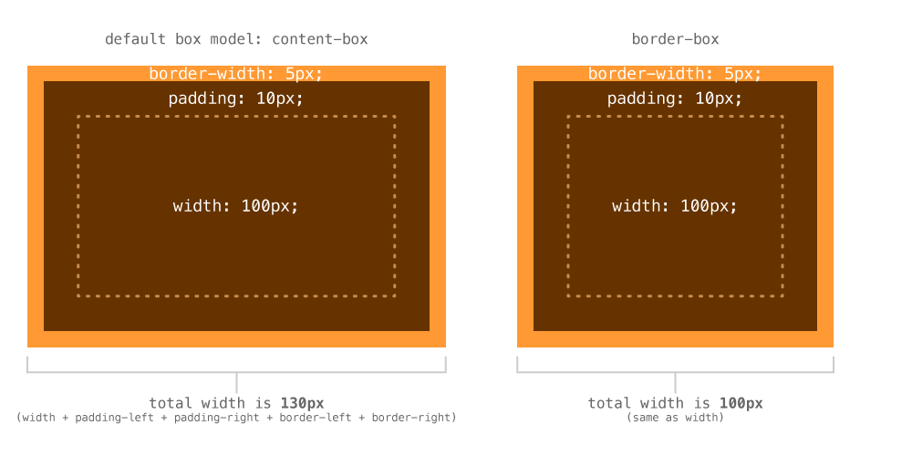

Every single thing you target with CSS, every single HTML element, is a box. The boxes line up beside each other, above each other, and below each other.

*Even though everything is a box and should be thought of as a box, that doesn’t mean it needs to look like a box—we can change the style of each box.*

---

## The box model

The box model is the name of part of the layout system browsers use when rendering your website. It’s a system that describes how each of the properties of a box interact with each other and how they interact with other boxes.


1. A box with no content isn’t visible, so content is the first layer
2. Outside content is the `padding`, pushing the edge of the box away from the content
3. Outside the padding is the `border`, the background colour stops here
4. Outside the box is the `margin`, a transparent layer pushing other boxes away

### Margin & padding

The `margin` and `padding` properties are used to put space around your box, either outside the box or inside the box.

- `margin` — adds spacing outside of the box, pushing other boxes away
- `padding` — adds spacing inside the box, pushing the content away from the border; the background colour is visible within the padding

```css
div {
	/* Will push other boxes 10 pixels away on all 4 sides */
	margin: 10px;
	/* Will push the content away from the box edge on all 4 sides */
	padding: 12px;
}
```

Since boxes have four sides, there are four different margins and paddings that can be changed.

- For margin, we have `margin-top`, `margin-right`, `margin-bottom`, `margin-left`.
- For padding, we have `padding-top`, `padding-right`, `padding-bottom`, `padding-left`.

#### Margin & padding shorthand

We can specify margin and padding using the properties listed above, but often it’s easier to use the shorthand version.

*Everything below applies equally to the padding shorthand.*

```css
div {
	/* margin: top right bottom left; */
	margin: 10px 12px 8px 6px;
}
```

Inside the shorthand `margin` declaration we can specify up to 4 values, each representing a side of the box.

For the order, we start at the top of the box and make our way clockwise around the box.



We can then start leaving off numbers from the end of the value list and the browser will match the opposing side’s value for any missing numbers.

```css
div {
	/*
		Since the left margin is missing, the browser will use the right value
		margin: top right/left bottom;
	*/
	margin: 10px 12px 8px;

	/*
		Since the bottom margin is missing, the browser will use the top value
		margin: top/bottom right/left;
	*/
	margin: 10px 12px;
}
```

#### Margin collapsing

Margins have some weird behavior when it comes to their top and bottom values. The bottom value of one box can collapse into the top value of the next—the browser choosing only the highest of the two.

```css
.box-1 {
	margin-bottom: 15px;
}

.box-2 {
	margin-top: 25px;
}
```

The distance between these boxes will *not* be `40px`—but instead the browser will pick the bigger of the two and choose it. So the margin between these boxes is `25px`.


### Width & height

Both `width` and `height` can be assigned to boxes. Usually we want widths set in some sort of relative measurement, like `%` or `em`.

Try to avoid using height—use other methods, like padding, instead. It’s especially important to be careful with height when working with text. If you user changes the font size in their browser, the whole layout could bust apart if there is a fixed height.

```css
div {
	/* Will be 30% the width of the parent element */
	width: 30%;
	/* Width based on the font-size */
	width: 35em;
}
```

#### What units to use

You’ll grow an intuition as to when to use each unit, but here are a couple of ideas:

- `%` — use percents for elements that should grow with the size of the browser, e.g columns, images
- `em` — use ems for elements that should grow with the size of the text, e.g. line-lengths
- `px` — use pixels for things that should never change size, e.g. logos, icons

#### Minimum & maximum values

For both width and height we can provide minimum and maximum values instead of fixed values.

- `min-width` — force the box to be at least this wide, but can grow wider
- `min-height` — force the box to be at least this tall, but can grow taller
- `max-width` — force the box to never exceed this width, but can get narrower than it
- `max-height` — force the box to never exceed this height, but can get shorter than it

```css
article {
	/*
		Force the box to be at least 10em high
		If the text needs more space, the box can still grow
		Much better than using `height`
	*/
	min-height: 10em;
}
```

```css
p {
	/*
		Force the paragraph to never exceed a width of 35em
		It’s a good way to control line-length
	*/
	max-width: 35em;
}
```

#### When to use height

There aren’t too many reasons to use `height`, `min-height` I use often, but I can usually create a whole website without ever touching the `height` property.

One example that is a good use of `height` is to make a box the same height as the browser window, for large banners and hero graphics.

```css
header {
	/* Would make the head the same height as the browser window */
	height: 100vh;
}
```

### Adjusting layout math with border box

The default box model layout system in websites doesn’t work very well with responsive and flexible websites. It’s best to change to a newer layout system so everything works more smoothly.

The newer layout system is called “Border Box” and changes the math used when calculating widths and heights of boxes.



- With the default box model, the `padding` and `border` add onto the `width` of the box, making it wider
- With border box, the `padding` and `border` are inside the `width` of the box, so the total width is the same as the value of `width`

For responsive and flexible designs this is extremely helpful. If you want a column to be 30% wide, you don’t have to subtract with width of the padding to make it exactly that wide.

So, to change your box model, add these lines of code to the very top of your website:

```css
html {
	box-sizing: border-box;
}

*, *::before, *::after {
	box-sizing: inherit;
}
```

**I add this code to the top of every single website I create.**

---

## Box decorations

There are lots of different decorations you can apply to a box.

### Background colour

The most basic decoration is `background-color`, which just applies a colour to the background, behind the padding.

```css
header {
	background-color: #000; /* Solid black */
	background-color: rgba(0,0,0,0.5); /* Semi-transparent black */
}
```

### Border

Border puts a line around the box, outside the background colour. The line can be solid, dashed, dotted, or an image.

The most basic `border` has 3 values: `width`, `style`, `color`:

```css
header {
	/* Apply the same border to all 4 sides of the box */
	border: 3px solid #000;
}
```

- `width` — a measurement to describe the thickness of the border
- `style` — what kind of border: `solid`, `dashed`, `dotted`, `double`, etc.
- `color` — any colour for the border, including semi-transparent ones

If you want to style a specific side of a border, you can target it directly with `border-top`, `border-bottom`, `border-left`, `border-right`.

```css
nav {
	border-bottom: 4px solid pink;
}
```

Each of the inner values also have their own properties like: `border-style`, `border-color`, `border-bottom-color`, etc.

```css
header {
	/* Applies border to all 4 sides */
	border: 3px solid #000;
	/* Overwrites bottom color */
	border-bottom-color: pink;
	/* Overwrites right width */
	border-right-width: 1px;
}
```

**Links**

- [MDN: Border](https://developer.mozilla.org/en-US/docs/Web/CSS/border)
- [MDN: Border-style](https://developer.mozilla.org/en-US/docs/Web/CSS/border-bottom-style)

### Border radius

The `border-radius` property allows you to add rounded corners to your boxes.

```css
a {
	/* Add 8px rounding to all 4 corners */
	border-radius: 8px;
}
```

You could also specify the `border-radius` in other units:

- `em` — the border radius would change with the font size
- `%` — of the box itself: using 50% would make a circle/oval

If you want to specify only certain corners, add more values, like `margin` and `padding`:

```css
a {
	/* Top left, bottom right & top right, bottom left */
	border-radius: 8px 10px;
	/* Top left & top right, bottom left & bottom right */
	border-radius: 8px 10px 6px;
	/* Top left & top right & bottom right & bottom left*/
	border-radius: 8px 10px 6px 12px;
}
```

**Links**

- [MDN: Border-radius](https://developer.mozilla.org/en-US/docs/Web/CSS/border-radius)

### Box shadow

Box shadow allows you to add a drop shadow to the box itself, where `text-shadow` adds to the text inside the box.

```css
div {
	box-shadow: 2px 4px 5px rgba(0,0,0,0.5);
}
```

When specifying `box-shadow` there’s four values to write out:

- `horizontal offset` — how far to shift the shadow left and right: positive numbers move right, negative move left
- `vertical offset` — how far to shift the shadow up and down: positive numbers move down, negative move up
- `blur radius` — how blurry the edge of the shadow will be, the bigger the number the lighter the shadow; `0` would make a crisp edge
- `spread` — *(optional);* how much bigger the shadow is than the box
- `color` — any colour you want, including semi-transparency

```css
div {
	/* Specifying `inset` inside the declaration will make the shadow inside the box */
	box-shadow: inset 0 0 5px rgba(0,0,0,0.5);
}
```

You can also specify multiple shadows on the box using a comma:

```css
div {
	box-shadow: 2px 4px 5px black, -2px -4px 5px red;
}
```

**Links**

- [MDN: Box-shadow](https://developer.mozilla.org/en-US/docs/Web/CSS/box-shadow)

**[☛ Decorations with images are covered in the “Using images” tutorial.](/topics/using-images/)**

---

## Video list

1. [Box model: margin & padding](https://www.youtube.com/watch?v=1PxUbAFQKoY&index=1&list=PLWjCJDeWfDdeEM254gHVHz26yswh59Hih)
2. [Box model: collapsing top & bottom margins](https://www.youtube.com/watch?v=4nGZ8OULcY0&index=2&list=PLWjCJDeWfDdeEM254gHVHz26yswh59Hih)
3. [Box model: width and height](https://www.youtube.com/watch?v=VEWSy3Gjybo&index=3&list=PLWjCJDeWfDdeEM254gHVHz26yswh59Hih)
4. [Box model: adjusting layout math with border box](https://www.youtube.com/watch?v=jG9sDpBJfqY&index=4&list=PLWjCJDeWfDdeEM254gHVHz26yswh59Hih)
5. [Box model: box decorations](https://www.youtube.com/watch?v=MGCbRH8gpQ0&index=5&list=PLWjCJDeWfDdeEM254gHVHz26yswh59Hih)

## Supplemental links

- [MDN: Box Model](https://developer.mozilla.org/en-US/docs/Web/CSS/box_model)
- [Opening the Box Model](http://learn.shayhowe.com/html-css/opening-the-box-model/)
- [Learn Layout](http://learnlayout.com/)
