GitHub Issues is a simple tool that allows you to track your progress, keep a task list, collect feedback, and report bugs for your GitHub hosted project.

---

## What are GitHub Issues?

GitHub Issues are a bug tracking system built into the GitHub service. They provide a way for people to submit problems, get feedback, and collaborate together on code projects.

---

## Making a new issue

On the right side of GitHub repositories is a tab called “Issues”. If it’s not there it’s because the owner has disabled issues.

After clicking the tab, there’s a big button: “New Issue”.

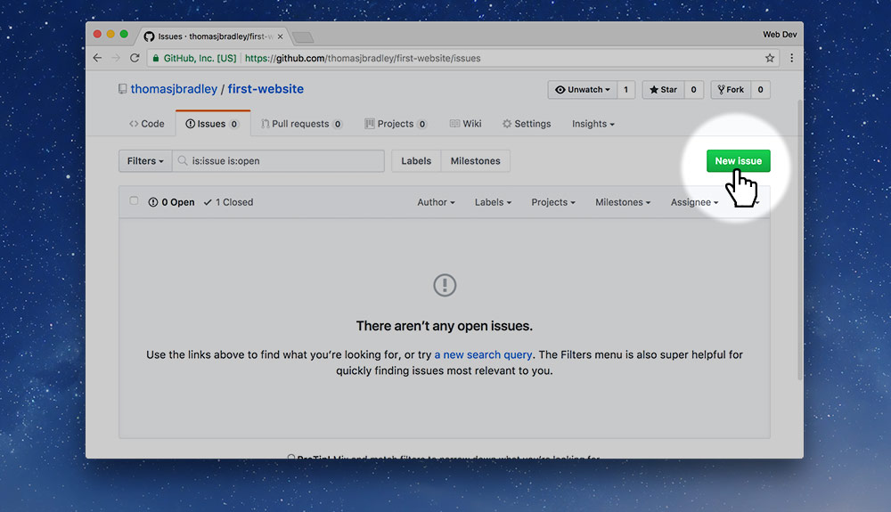

Creating a new issue is as simple as giving it a descriptive title and then describing the problem in detail using the “Write” section.

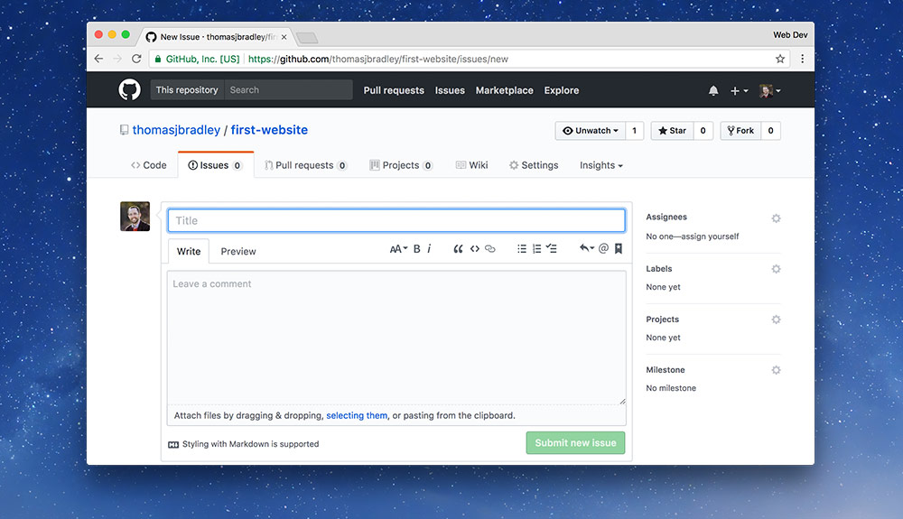

When writing issues it’s always a good idea to be as descriptive as possible. Describe everything about the issue you can, in great detail to help the repository owner understand the problem in their code.

### Markdown support

In writing area of the issue, you can use Markdown to format your description, including: bold, italic, lists, and more.

**[☛ Learn about Markdown formatting](/topics/markdown/)**

### Writing code inline

When describing problems in the code it’s often a good idea to provide code samples and test cases in the GitHub Issue.

Using Markdown you can embed code samples with backticks.

**[☛ Learn about writing code in Markdown](/topics/markdown/#code)**

### Attaching files

Attaching an image or screenshot to an issue is as easy as dragging it from your computer and dropping it into the “Write” section of the issue screen.

### Linking to lines of code

If you want to link directly to a line of code in the repository you can find that file and click the line numbers. Pressing `Shift` will allow you to select multiple lines.

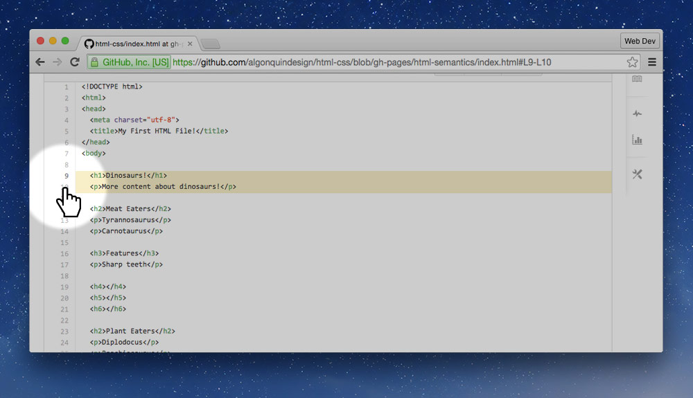

After you’ve selected the lines, copy the URL and paste it into the issue.

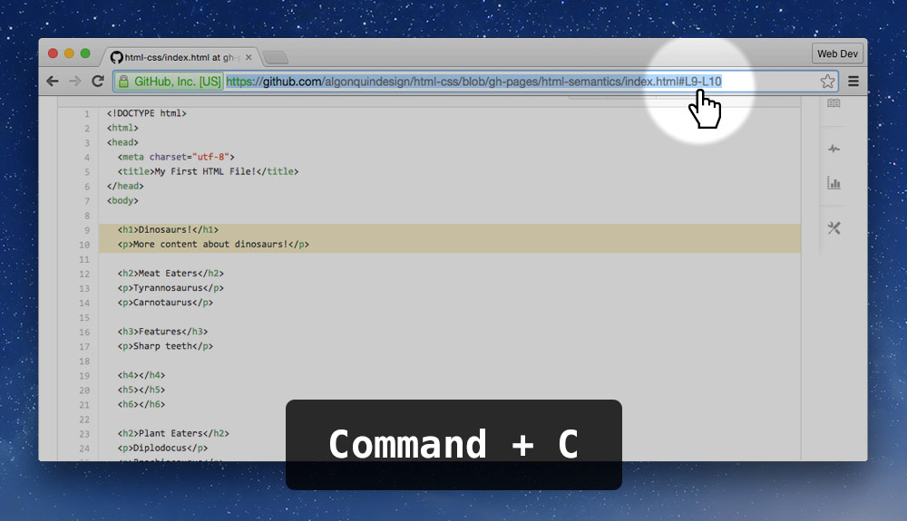

*You’ll notice that the URL now has a hash appended with the highlighted line numbers.*

### Mentioning other people

If you’d like to get feedback from someone specific when writing the issue, you can mention them by their GitHub username.

`@` — type an @-symbol followed by their username. If they’re already part of the repository it will autocomplete.

### Referring to another issue

If you’d like to refer to another issue, maybe because it’s related or similar, GitHub will put references at the bottom of the issues.

`#` — type a #-symbol followed by the issue’s ID number. GitHub will actually autocomplete all other issues in the repository.

### Adding emoji to issues

Emoji can be a helpful way to specify human emotions in your GitHub Issues.

`:` — type a colon and all of GitHub’s emoji will autocomplete.

---

## Commenting on issues

After an issue is created anybody and comment and provide feedback on the issue—ideally to help improve and solve the problem.

*Everything above: Markdown formatting, mentioning, emoji, images, etc. can be included in comments.*

---

## Closing an issue

After the problem has been resolved to everybody’s satisfaction closing the issue archives it, making it inactive.

All closed issues can be seen in the “Closed” section of the issues interface.

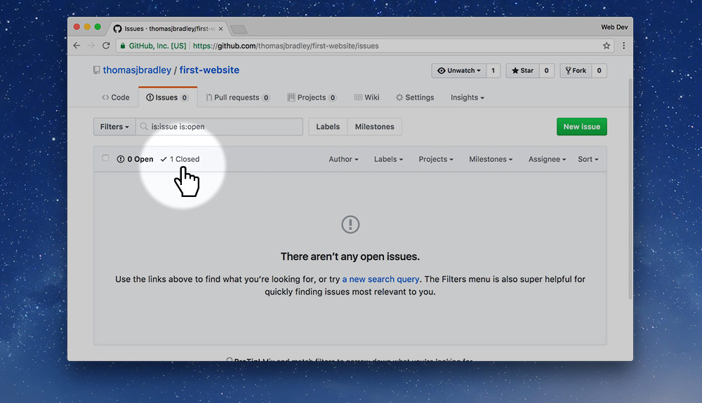

---

## Project management with GitHub Issues

Lots of people and companies use GitHub as a project management tool. Everything is based around issues: creating task lists in issues, assigning tasks to people, and setting due dates.

### Labels

Labeling issues is a helpful way to organize them into groups. You can create any label that makes sense for you or just use GitHub’s default labels.

All you have to do is just click on the label you want to add.

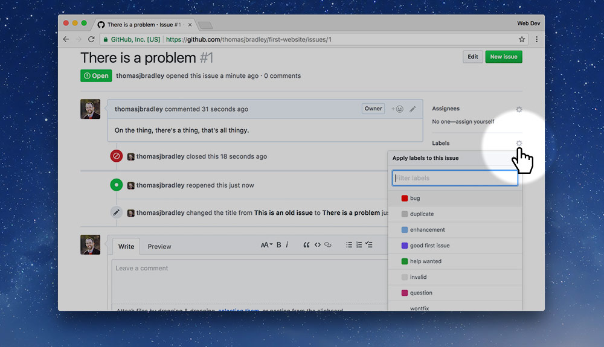

If you want to add more labels go to the “Labels” tab of the issues interface.

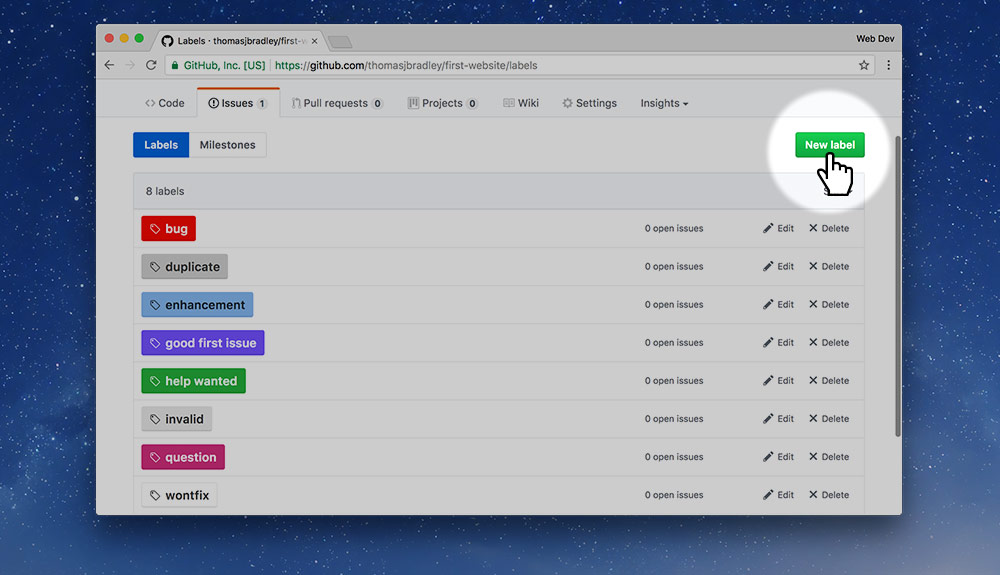

### Milestones

Milestones allow you to group a bunch of issues together and assign a due date to them. Often milestones are labeled for version numbers, like “v1.1” or “beta”.

Before assigning milestones to issues they need to be created. From the “Issues” interface you can create new milestones.

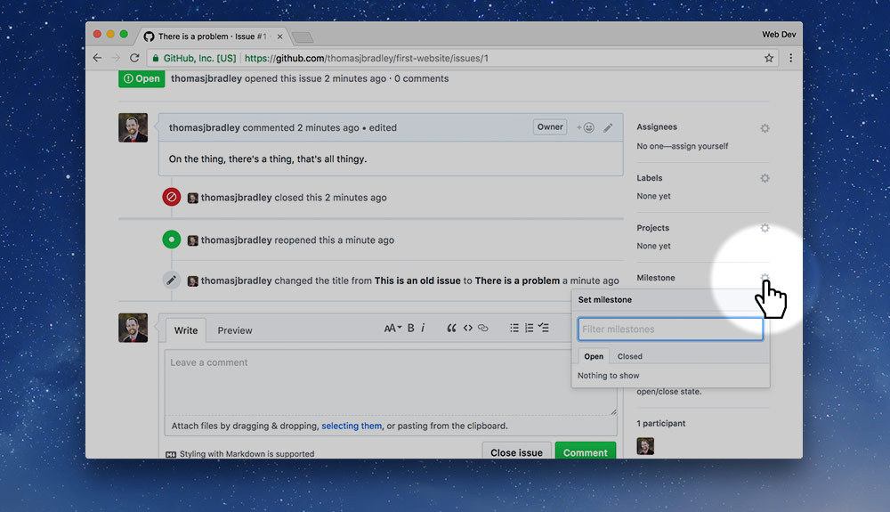

The new milestone screen allows you to add a title and description as well as defining a due date.

After the milestone has been created, it can be added to the issue using the “Milestone” control.

**Links**

- [Semantic Versioning](http://semver.org/)

### Assigning the issue to others

If you want a specific person to deal with an issue, instead of mentioning them you can assign the issue directly to the user using the “Assign” control. It’ll give you a list of everybody who’s a part of the project.

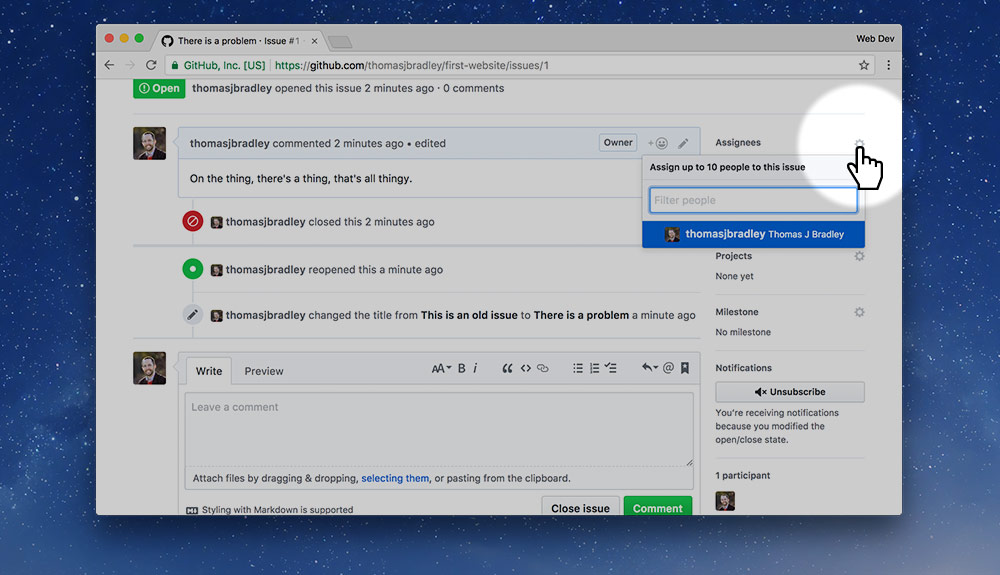

### Task lists

Using Markdown-like task lists in GitHub Issues is good way to denote the order that issues should be completed, and maybe who should look into them.

**[☛ Learn how to make task lists](/topics/markdown/#task-lists)**

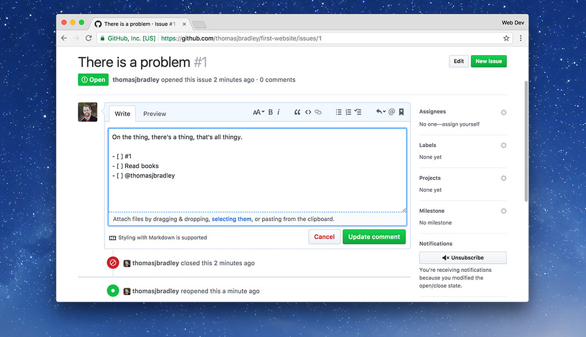

- You can just mention the issue number in a task list
- You can mention the person who should look into the issue

Every member can even check off the task item when complete and the issue will be updated.

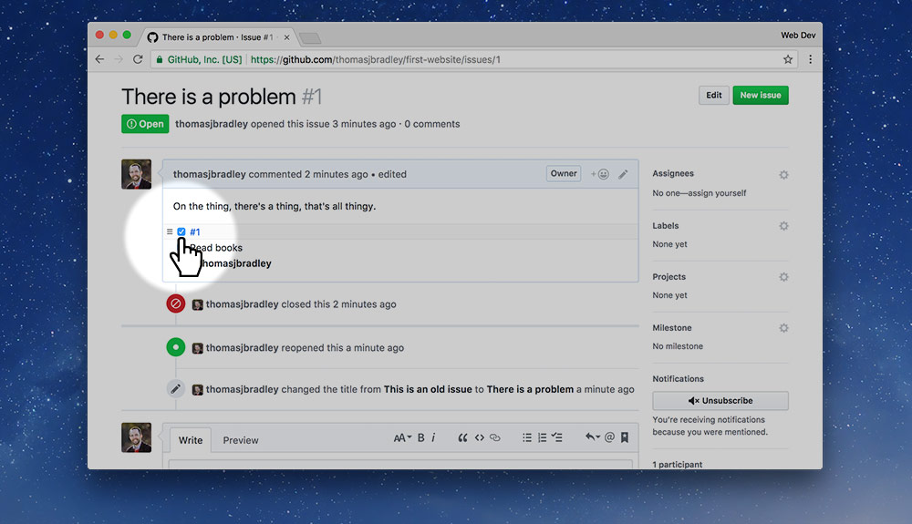

---

## Video list

1. [GitHub: Using Issues](https://www.youtube.com/watch?v=J3STGo6ZwYA&index=8&list=PLWjCJDeWfDdfSZOQYvsy_jJiAvx4uaJLB)
2. GitHub: Using Issues for project management

## Supplemental links

- **[GitHub: Mastering Issues](https://guides.github.com/features/issues/)**
- [GitHub Help: Managing projects](https://help.github.com/categories/managing-projects/)
