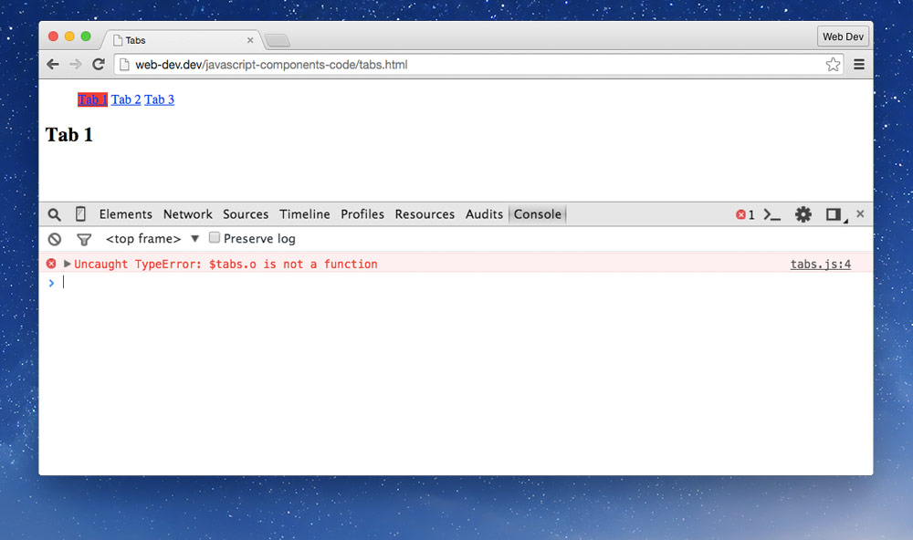
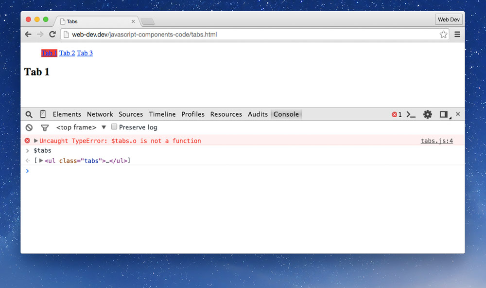
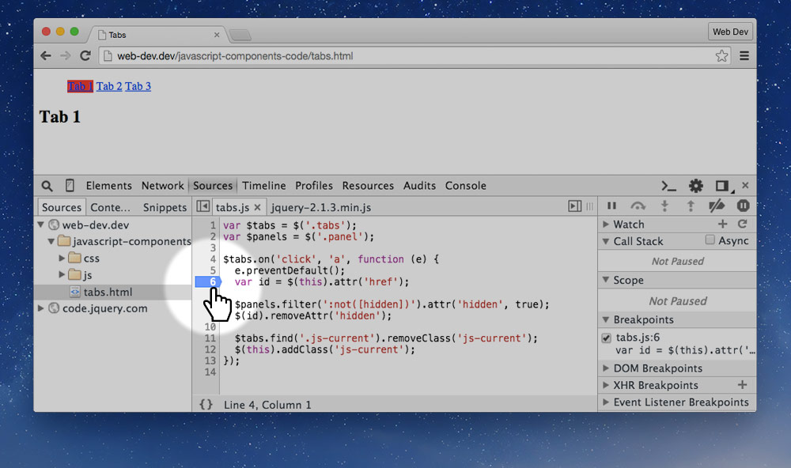
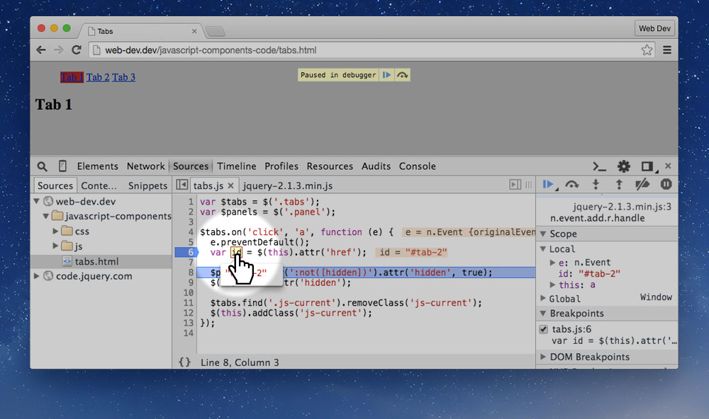
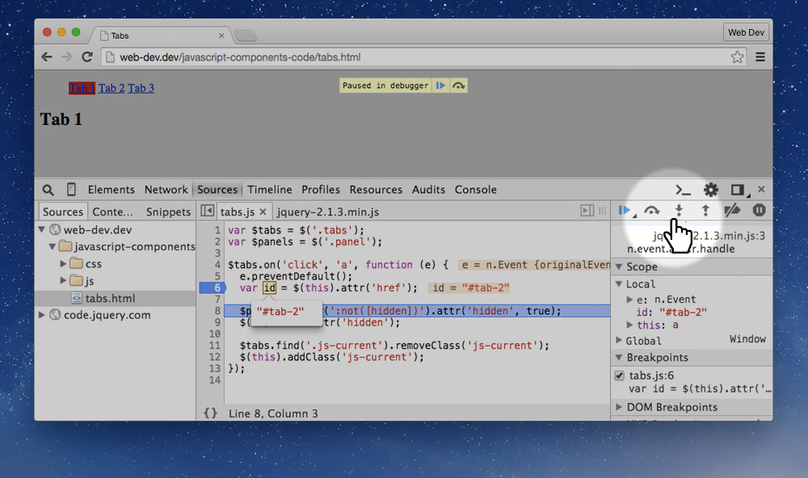

group: web-dev-3
playlist: PLWjCJDeWfDdeVVOm7HffeuE9XC9qEbrxk
download: https://github.com/acgd-learn-the-web/javascript-debugging-code/archive/master.zip
github: https://github.com/acgd-learn-the-web/javascript-debugging-code
---

Broken code can be a nightmare, but there are lots of tools to help us debug our Javascript issues, many built into the browser.

---

## Browser developer tools

The developer tools built into your browser provide lots of features to help you debug your Javascript code.

### Web console

The first thing that’s helpful is the Console. In the console tab you can see error messages from your Javascript code and what line that error was found.



#### Console command line

Also, at the bottom of the console you can type Javascript and have it executed immediately within the scope of your code. You can use this to make quick tests on your code or to debug what certain things are.



*The console command line has access to all your functions and all the Javascript included on your website.*

### Commenting out pieces of code

One quick way to debug code is to comment out lines of code. Commenting out helps you pinpoint specific problems or helps you disable lines you know for sure are working.

- `//` — double slashes for single line comments
- `/*  */` — slash-star star-slash for multi-line comments

### Console logging

Inside our code we often need to determine what’s contained in variables or to see what parts are executing in our program.

Using `console.log()` is a quick way to see what’s going on.

```js
var planet = 'Uranus',
  planets = ['Jupiter', 'Saturn', 'Neptune'],
  i = 0, t = planets.length
;

// console.log() will write out the contents of a variable
console.log(planet); // Uranus
console.log(planets); // [Jupiter, Saturn, Neptune]

for (i; i<t; i++) {
  // Use console.log() to see each iteration of the loop
  console.log(i);
}

// Use console.log() to see what direction the if-statement goes
if (planet == 'Uranus') {
  console.log('Is Uranus!');
} else {
  console.log('Not Uranus!');
}
```

**Don’t forget to remove all instances of `console.log()` from your final code.**

#### Other console methods

There’s a few other functions within `console` that do slightly different things:

- `console.warn('…')` — same as `log` but with a little warning icon
- `console.error('…')` — similar to `log` but also displays a list of each step of execution taken, called a stack trace
- `console.assert(boolean, '…')` — write a message to the console if the first argument is `false`
- `console.count('…')` — display a count of how many times this line was executed
- `console.dir(object)` — display all the properties of an object
- `console.group()` — start a grouping of console messages
- `console.groupEnd()` — end the console messages group
- `console.time('…')` — start a timer, specifying a label
- `console.timeEnd('…')` — end the timer, displaying the execution time in the console; must specify the same label

### Breakpoints & stepping

The browser developer tools have a series of more advanced debugging tools that allow us to closely monitor and explore the code as it’s executing.

#### Setting breakpoints in Javascript

First we go to the debugger and find the line of code that’s causing us problems, or maybe a little before it. Clicking on the line number will create a breakpoint. Next time when the Javascirpt is executed it will stop at that point and we can explore what’s happening in our program.



#### Exploring variables

When the code is paused at the breakpoint and we can explore the different variables and values of what the Javascript currently understands.

- Move your mouse over each different piece of code to inspect it
- Look in the side panel for a list of different piece of code



#### Continuing execution

If we want to move onto the next line of code we can click one of these buttons:



- **Step over** — will advance to the next line of code in the same function
- **Step into** — will advance to the next line, if the next line is a function it will enter it
- **Step out** — will exit the current function and advance

#### Stopping the debugger from entering files

When using large frameworks and libraries in our code we often don’t want to inspect their code, only ours. So we can “black box” specific code files from the debugger, therefore stopping the debugger from entering them.

- In Chrome/Opera you can right-click on the filename and press “Blackbox Script”.
- In Firefox you click the filename then press the eyeball in the bottom left corner.

---

## Validation

Validation is a helpful way to find issues in your Javascript code—you can validate your Javascript using a few online tools̋.

**[☛ Check out the Javascript validation tutorial.](/validation/#javascript)**

---

## Video list

1. [Javascript debugging: console](https://www.youtube.com/watch?v=7EoLvH7roYc&list=PLWjCJDeWfDdeVVOm7HffeuE9XC9qEbrxk&index=1)
2. [Javascript debugging: commenting out code](https://www.youtube.com/watch?v=oUW1e6g1oNc&list=PLWjCJDeWfDdeVVOm7HffeuE9XC9qEbrxk&index=2)
3. [Javascript debugging: breaking & stepping](https://www.youtube.com/watch?v=5m9Kfwx0rMs&index=3&list=PLWjCJDeWfDdeVVOm7HffeuE9XC9qEbrxk)

## Supplemental links

- [Firefox: Web console](https://developer.mozilla.org/en-US/docs/Tools/Web_Console)
- [Firefox: Debugger](https://developer.mozilla.org/en-US/docs/Tools/Debugger)
- [Firefox: Console API](https://developer.mozilla.org/en-US/docs/Web/API/console)
- [Chrome: Debugging Javascript](https://developer.chrome.com/devtools/docs/javascript-debugging)
- [Chrome: Console API Reference](https://developer.chrome.com/devtools/docs/console-api)
- [A Re-introduction to the Chrome Developer Tools](http://paulirish.com/2011/a-re-introduction-to-the-chrome-developer-tools/)
