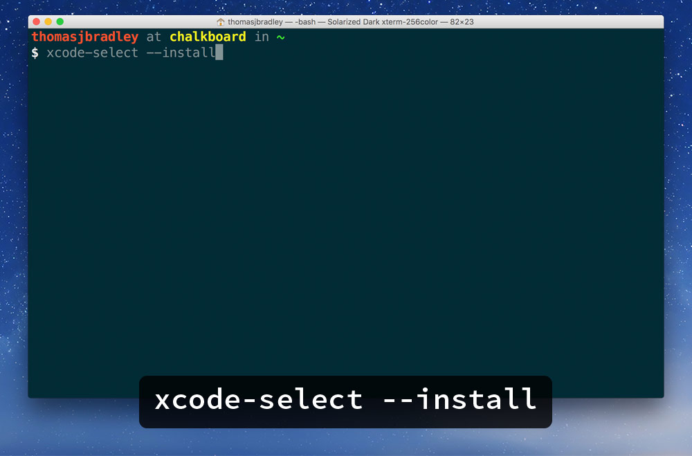
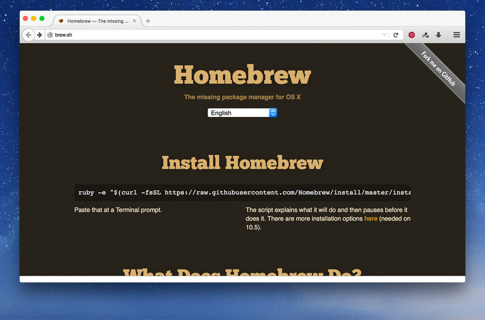
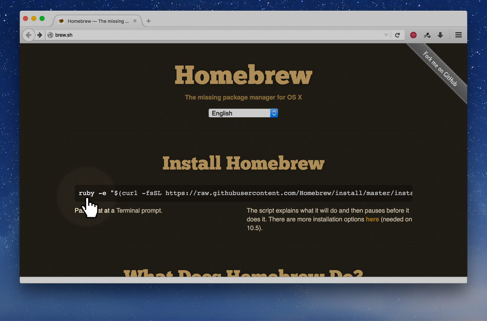
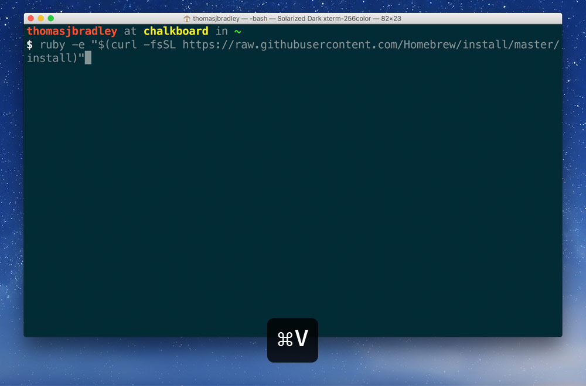
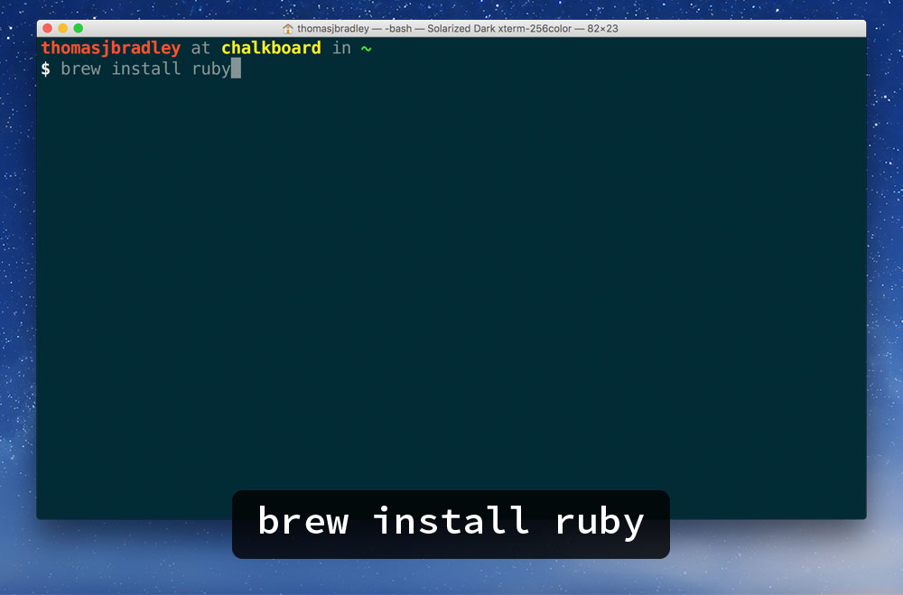

On Mac it isn’t too difficult to install Jekyll, but it does require everything to be completed from within Terminal.

---

## This tutorial is for newer Mac OS X, 10.9+

If you have an older version of Mac OS X, specifically 10.8 and below, [**☛ See the Older Mac OS X installation guide.**](/topics/jekyll-installation-older-mac/)

---

## Installing the command line tools

We need to install the Command Line Tools before installing Jekyll using Terminal.

You can install the command line tools directly from Terminal.

```bash
xcode-select --install
```



It will prompt you to install and approve a terms of use then download and install the tools on your computer.

*You won’t see anything new on your computer, everything happens in the background.*

---

## Installing Homebrew

Homebrew is a package manager for Mac & Terminal—it’s like an app store, but specifically in terminal and mostly for developer tools.

First go to the [Homebrew website](http://brew.sh/).



On the page, you’ll see a chunk of code—copy it.



Paste it into your Terminal and hit return, your computer will go off an install Homebrew.



**It will prompt you for your computer’s password. As you type it in you won’t see anything—but it is being entered. When complete, hit `Return`.**

---

## Installing Jekyll in Terminal

First we need to install the programming language Jekyll is written in: Ruby.



```bash
brew install ruby
```

Next up we need to install Jekyll using Ruby’s package manager, `gem`:


```bash
gem install jekyll
```

*This will go and download a whole bunch of stuff to your computer, when it’s done, you have Jekyll.*

---

## Video list

- [Jekyll: installation](https://www.youtube.com/watch?v=oiNVQ9Zjy4o&index=1&list=PLWjCJDeWfDdfVEcLGAfdJn_HXyM4Y7_k-)
