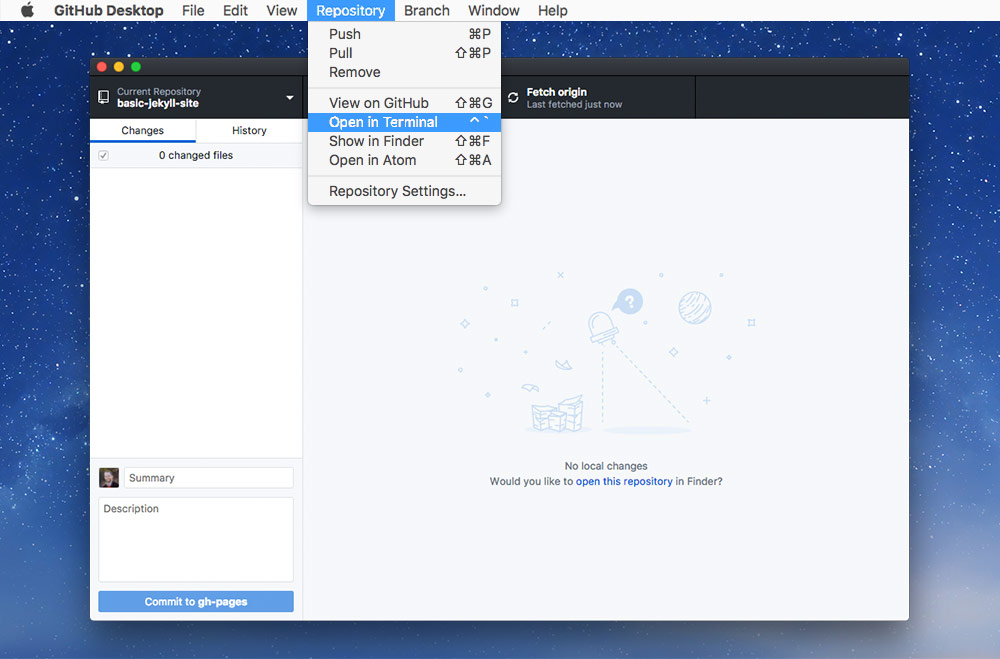
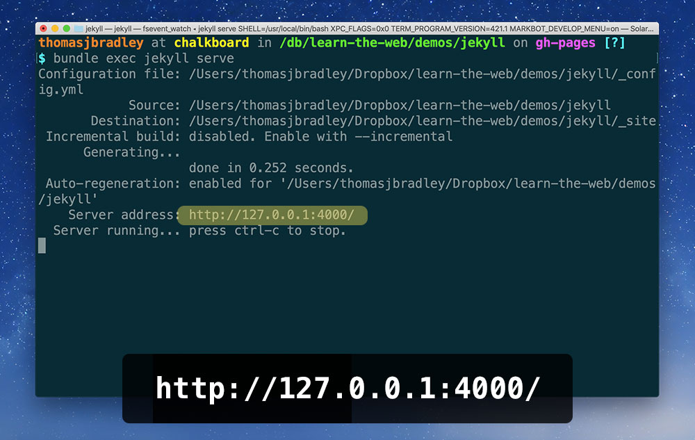
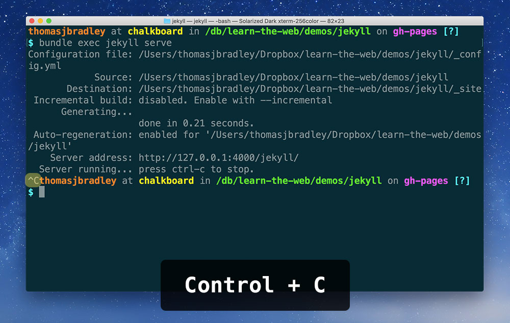

Jekyll is a command line tool so we have to use the Terminal application on our computer to start, stop, and run Jekyll.

---

## Open folder in Terminal

*This guide assumes you’re running Jekyll on GitHub Pages and that you’ve followed the setup directions here: [**☛ Jekyll installation**](/topics/jekyll-installation/)*

In the GitHub application, click `Repository > Open in Terminal`.



**Or** press `Command+T`.

---

## Run Jekyll

When in Terminal, type the following command:

```bash
$ jekyll serve --watch --baseurl=""
```


Jekyll will now be available in your browser at the following URL: **<http://127.0.0.1:4000>**.

You can see the address Jekyll provides in the Terminal, under the “Server Address” entry:



**Keep this running the whole time you’re working on your Jekyll website.**

---

## Stop Jekyll

In Terminal, you can press the following shortcut key: `Control+C`



**Or** just quit Terminal.

---

## Video list

- [Jekyll: starting and stopping](https://www.youtube.com/watch?v=Vvh-PWMOf4g&list=PLWjCJDeWfDdfVEcLGAfdJn_HXyM4Y7_k-&index=4)
