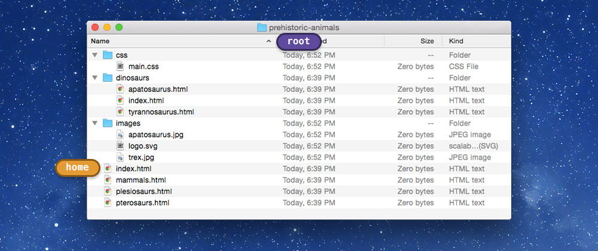
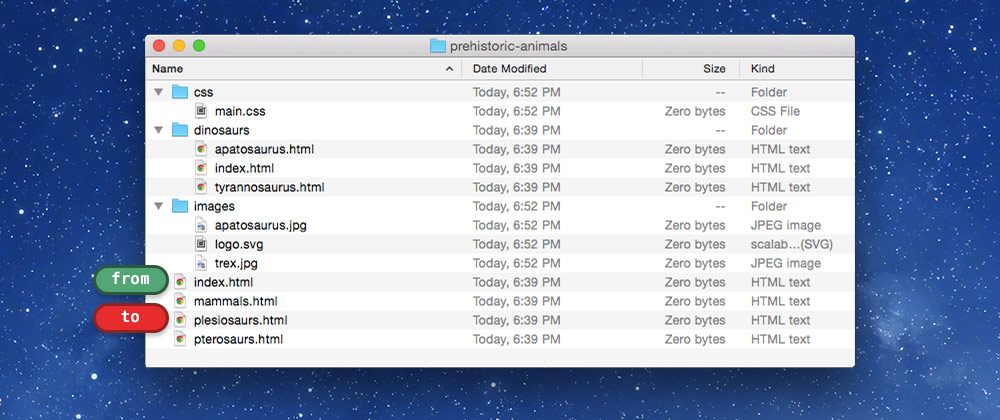
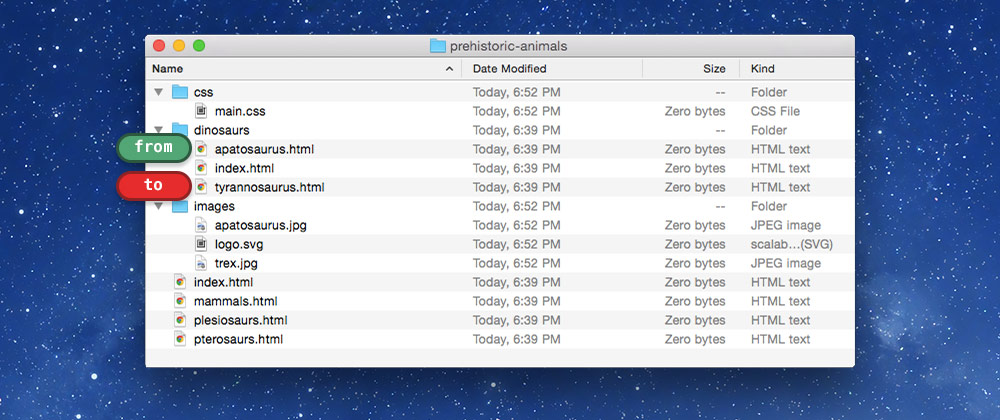
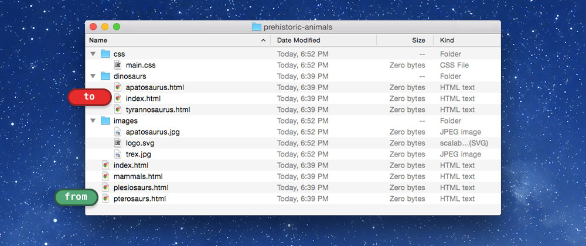
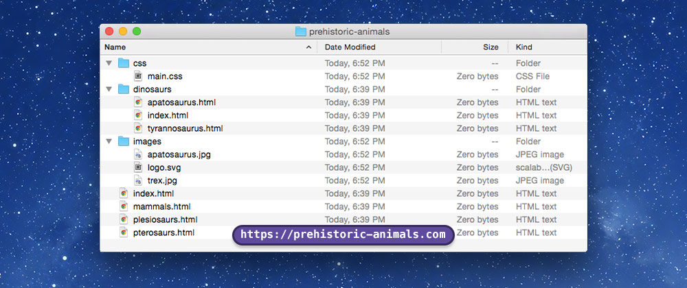

As a developer you need to become intimately familiar with how the directory system works.

---

## Paths & URLs

Paths are the syntax we write to link and find files and folders on our computer.

When it comes to paths for a website they also turn into URLs. **So paths and URLs are exactly the same when making websites.**

**[☛ Refer to the naming conventions](/topics/naming-conventions)**

---

## The root folder

To start paths we need to understand how our folder is set up. The “root” folder is the primary folder for the website. Our Git repo. Where our homepage resides.



If the above image our root folder is `prehistoric-animals`—you can see it in the title bar of the window.

Our homepage for our website is the `index.html` file directly inside our `root` folder. It’s the default file. The web server will automatically call it to display our homepage, therefore it **must be named `index.html`.**

---

## Paths in the same folder

When creating a path within the same folder we only need to specify the filename of that folder.



- From: `index.html` to: `plesiosaurs.html`<br>
	— Path: `plesiosaurs.html`
- From: `index.html` to: `pterosaurs.html`<br>
	— Path: `pterosaurs.html`



Even if we’re inside a folder and need to get to another file in that same folder we just write the name of it.

- From: `apatosaurus.html` to `tyrannosaurus.html`<br>
	— Path: `tyrannosaurus.html`

We can start these paths with `./` and get the same effect:

- From: `index.html` to: `pterosaurs.html`<br>
	— Path: `./pterosaurs.html`

*The `./` is implicit, meaning it will be added if we don’t add it ourselves.*

---

## Moving into folders

To write a path that moves into a folder we specify the folder name, followed by a forward slash, then the file name.


- From: `index.html` to: `tyrannosaurus.html`<br>
	— Path: `dinosaurs/tyrannosaurus.html`
- From: `index.html` to: `main.css`<br>
	— Path: `css/main.css`
- From: `index.html` to: `logo.svg`<br>
	— Path: `images/logo.svg`

### Sub-folder index

If a folder has its own `index.html` file we don’t need to specify that in the path.



- From: `pterosaurs.html` to: `index.html`<br>
	— Path: `dinosuars/`

---

## Moving out of folders

When moving out of folders we use `../`, then follow all the rules above.


- From: `apatosaurus.html` to: `pterosaurs.html`<br>
	— Path: `../pterosaurs.html`
- From: `apatosaurus.html` to: `main.css`<br>
	— Path: `../css/main.css`
- From: `apatosaurus.html` to: `logo.svg`<br>
	— Path: `../images/logo.svg`

If you need to go out of many folders, just add more:

```
../../          Out of 2 folders
../../../       Out of 3 folders
../../../../    Out of 4 folders
etc.
```

---

## Relative vs. absolute

All of the paths we learned above are all relative to the location you’re currently in—called document relative.

- If the path starts with nothing it means, “start where I am and go from there.”
- If the path starts with `../` it means, “go up one folder from where I am and then go from there.”

But we can be very specific about our paths, making them absolute.

### Absolute

Where relative paths are in relation to the current location, absolute paths are in relation to the top-level Internet and URLs.

- If we start a path with a protocol (http[s]) it means, “Start at the top level of the Internet, replacing everything, and work from there.”



If our website was hosted at the domain `prehistoric-animals.com` we’d get the following paths:

```
https://prehistoric-animals.com/
https://prehistoric-animals.com/plesiosaurs.html
https://prehistoric-animals.com/dinosaurs/
https://prehistoric-animals.com/dinosaurs/apatosaurus.html
https://prehistoric-animals.com/css/main.css
https://prehistoric-animals.com/images/trex.jpg
```

**This is how we write paths to other websites:**

```
https://www.google.ca/
https://github.com/
http://www.starwars.com/databank/millennium-falcon
http://www.amazon.ca/Dragon-Doom-Rose-Estes/dp/0880381000/
```

### Protocol relative

If we don’t want to write the protocol (https) we can just leave it off and the browser will automatically add it for us.

*Be careful though, because the browser will add the same protocol that our website is currently running at.*

- If we start a path with a `//` it means, “start immediately after the protocol, replacing all domains, and work from there.”

```
//prehistoric-animals.com/
//prehistoric-animals.com/plesiosaurs.html
//prehistoric-animals.com/dinosaurs/

//github.com/
//www.starwars.com/databank/millennium-falcon
```

### Root relative

If we only want to write paths within our domain but have more absolute-like paths, we can use root-relative paths.

- If we start a path with a `/` it means, “start at the root domain and work from there.”

```
/    (goes to the homepage)
/plesiosaurs.html
/dinosaurs/
/dinosaurs/apatosaurus.html
/css/main.css
/images/trex.jpg
```

---

## Where do we use this stuff?

**Everywhere.**

- In HTML links, the `href`:
	```html
	<a href="../in/here.html">…</a>
	```

- In image tags, the `src`:
	```html
	
	```

- When linking CSS, the `href`:
	```html
	<link href="/in/here.css" rel="stylesheet">
	```

- When using `background-image` in CSS:
	```css
	background-image: url("in/here.jpg")
	```

- In the URL bar of your browser to navigate around.

- In Finder’s “Go to Folder…”, `⌘⇧G`.

- The command line on your computer, aka the Terminal.

---

## Why doesn’t it work on my local website?

A few of the different path styles won’t work on your local website if you aren’t using a web server.

The reason these don’t work is because we are often using the `file://` protocol to view our websites. If you drag your HTML file directly to the browser, look at the URL closely, it should start with `file://`—that means it’s only on your computer, not on the Internet.

- `/` — root relative won’t work because it will link to the root of your hard drive, not the root of the domain because there is no domain.
- `//` — protocol relative won’t work because your protocol is `file`, where everything else on the Web is `http` or `https`.

These two forms of syntax specifically require a web server to work properly.

---

## Syntax summary

Here’s the different syntax you need to know for dealing with paths:

- `start with nothing` *or* `./` — single dot + slash<br>
	Start in the same location as this file and work from there.<br>
	Implicit, if you reference a filename that doesn’t start with a slash, e.g. `index.html` is the same as `./index.html`
- `../` — double dot + slash<br>
	Start in the same location as this file, go out a folder, and work from there.<br>
	Can be combined: `../../` — goes out two folders
- `/` — slash at the beginning<br>
	Start at the root domain and work from there.
- `//` — double slash at the beginning<br>
	Start immediately after the protocol, replacing all domains, and work from there.
- `https://` — protocol at the beginning<br>
	Start at the top level of the Internet, replacing everything, and work from there.

---

## Paths on your computer

If you’re using these paths just on your computer, for “Go to Folder…” and the Terminal, there’s a few differences:

- `/` — is the root of your computer’s hard drive
- `//`, `http://` — will do nothing because you aren’t on the Web

And we get an extra starting character, `~`: start in your home folder.

- `~/Desktop` — go to my own Desktop folder
- `~/Dropbox` — go to my own Dropbox folder

---

## Supplemental links

- [Wikipedia: Paths](https://en.wikipedia.org/wiki/Path_%28computing%29)
- [Wikipedia: Uniform resource locator](https://en.wikipedia.org/wiki/Uniform_resource_locator)
