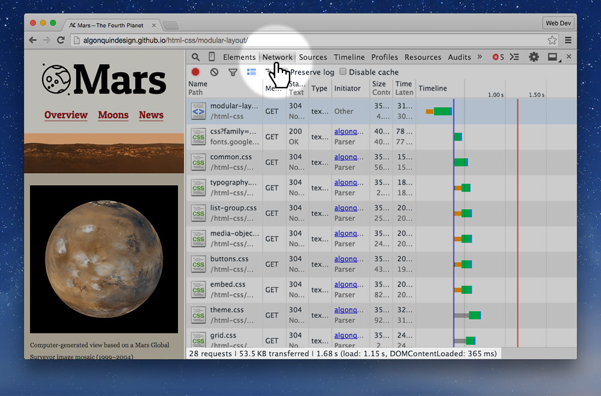
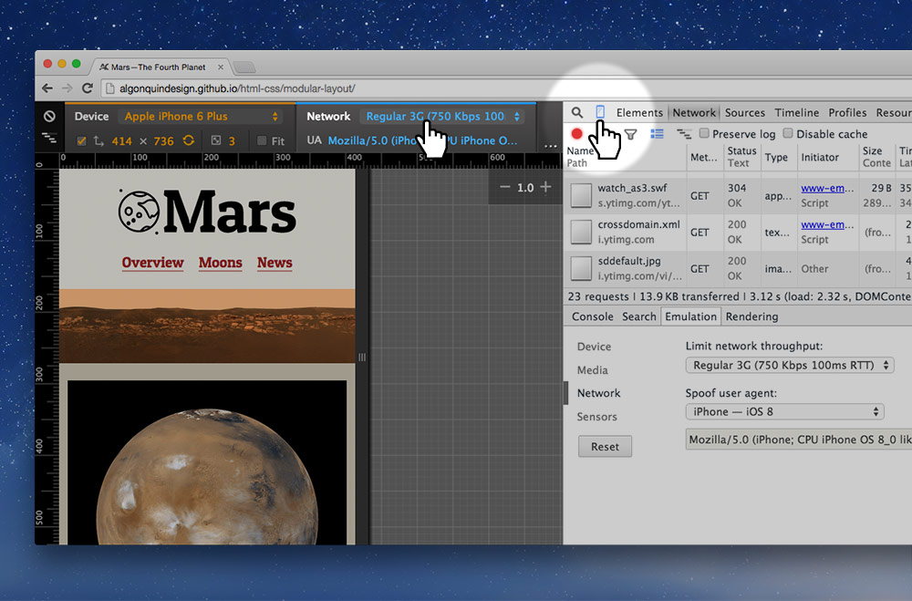
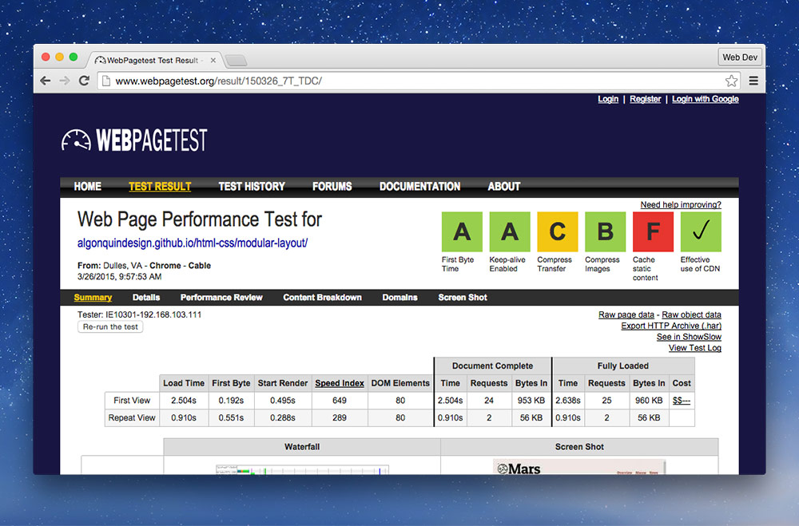
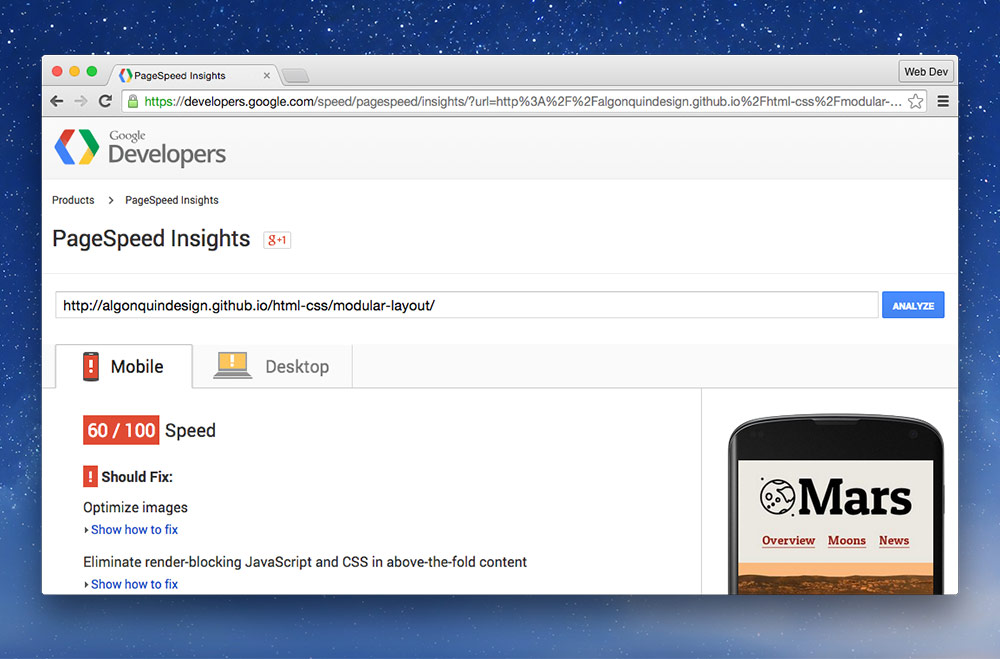

Making your website fast is extremely important for usability and probably one of *the* most important design considerations for the web.

> “Good performance *is* good design”
> — Brad Frost

---

## Why performance is important

None of us want to wait for websites to load. I’m pretty confident that all of us have closed a website because it was taking too long to load. That’s why performance matters.

The slower your website the less people will use it, the less purchases, and the more ire your users direct towards you. Also, Google is starting to penalize slow and non-mobile–friendly websites in search results, even marking them as “slow”.

Performance as a design constraint is important to consider, especially on mobile devices where the Internet connection is flaky and not near as fast as our home computers.

*Remember we’re building websites for the **World** Wide Web: there are many places in the world with much slower connections than us.*

**Links**

- **[Impact of performance](https://github.com/zenorocha/browser-diet/wiki/Impact-of-performance)**
- [Performance As Design](http://bradfrost.com/blog/post/performance-as-design/)

---

## Checking performance

There are lots of tools provided by browsers, online, and command line to help check the performance of our websites.

### Browser developer tools

The browser’s developer tools have a few options: the network panel, the performance audit, and the connection emulator.

The Network panel shows a waterfall of all the different resources used to load the website with some important data across the bottom.

The Performance Audit panel will test the website for common performance issues and give you a report.

#### Simulating slower Internet

With the Chrome Developer Tools we can even simulate different Internet connections to see how our website performs.

*It’s a good idea to test your website with a slower connection to see how it looks.*

### Testing tools

There are a bunch of tools to help you diagnose performance problems on your website, here are a few popular ones.

The most popular testing tool is [Web Page Test](http://www.webpagetest.org/)—an open source suite of tools for testing performance. You can use the online version or create your own instances.

Another popular tool is [Google’s Page Speed](https://developers.google.com/speed/pagespeed/): an online tool or a browser extension. (Also check out [Yahoo’s YSlow](http://yslow.org/)).

**Links**

- **[Web Page Test](http://www.webpagetest.org/)**
- **[Google PageSpeed](https://developers.google.com/speed/pagespeed/)**
- [Google Mobile-Friendly Test](https://www.google.com/webmasters/tools/mobile-friendly/)
- [Yahoo YSlow](http://yslow.org/)
- [Pingdom Website Speed Test](http://tools.pingdom.com/fpt/)
- [What Does My Site Cost?](http://whatdoesmysitecost.com/)
- [Speedgun.io](http://speedgun.io/)
- [CSS Stats](http://cssstats.com/)
- [SpeedCurve](https://speedcurve.com/)
- [Calibre](https://calibreapp.com/)
- [Understanding webpagetest.org](http://www.sitepoint.com/video-understanding-webpagetest-org/)

---

## Performance budgets

Performance budgets are a good constraint to add to your web design to help push performance as an important factor.

There are lots of different metrics that can be used when creating your performance budget: load time, number of requests, page size, tool scores, etc. Pick the items that make the most sense for your situation and discuss them with your team.

### Example performance budget

Here’s an example performance budget that might work for you:

- ❏ **Load time:** < 1s (1000ms)
- ❏ **Speed index:** < 800
- ❏ **Page size:** 800 KB transfer size maximum
- ❏ **Requests:** 15 requests maximum
- ❏ **Pass:** Google Mobile Friendly Test
- ❏ **Page Speed:** achieve *green* on Mobile & *green* on Desktop

**Links**

- [How to Make a Performance Budget](http://danielmall.com/articles/how-to-make-a-performance-budget/)
- **[Performance Budget Metrics](http://timkadlec.com/2014/11/performance-budget-metrics/)**
- [How Speed Index on webpagetest.org works](https://sites.google.com/a/webpagetest.org/docs/using-webpagetest/metrics/speed-index)

---

## Basic performance techniques

Here’s a list of things to help fix performance problems on your website, especially to speed up download time.

Use these in conjunction with a performance budget to get the fastest website possible.

The thing that affects the website’s performance the most is images—spend lots of time on optimizing images:

- Use as few images as possible
- Properly save them with “Save for Web” from Photoshop
- Smush them with ImageOptim or SVGO
- Don’t make them bigger than they need to be in the design

A few other things you can do to your website to make it load faster are:

- Remove any unused or duplicate HTML & CSS
- Make sure there’s no broken links
- Put your CSS `<link>` tag at the top of the HTML
- Be careful not to use too many font styles

**Links**

- **[Ten Quick Fixes to Reduce Page Weight](http://www.sitepoint.com/ten-quick-fixes-reduce-page-weight/)**
- **[How to Lose Weight in the Browser](http://browserdiet.com/)**
- [14 Rules for Faster-Loading Web Sites](http://stevesouders.com/hpws/rules.php)
- [The Complete Guide to Reducing Page Weight](http://www.sitepoint.com/complete-guide-reducing-page-weight/)
- [Front-end performance for web designers and front-end developers](http://csswizardry.com/2013/01/front-end-performance-for-web-designers-and-front-end-developers/)

---

## Advanced performance

There’s a bunch more you can do to make your website super fast.

**[☛ Check out the other things you can do in the advanced performance tutorials.](/topics/advanced-performance/)**

---

## Video list

1. [Performance: browser developer tools](https://www.youtube.com/watch?v=8OGVUvrInWo&index=1&list=PLWjCJDeWfDddLcBzFUsgF09gHma3q48XD)
2. [Performance: online tools](https://www.youtube.com/watch?v=ifMHChSpZfE&index=2&list=PLWjCJDeWfDddLcBzFUsgF09gHma3q48XD)
3. [Performance: images](https://www.youtube.com/watch?v=bfkwvwK28Vs&list=PLWjCJDeWfDddLcBzFUsgF09gHma3q48XD&index=3)
4. [Performance: code](https://www.youtube.com/watch?v=fMJIgVrceUQ&index=4&list=PLWjCJDeWfDddLcBzFUsgF09gHma3q48XD)
5. [Performance: fonts](https://www.youtube.com/watch?v=wPKu4l9hWCE&index=5&list=PLWjCJDeWfDddLcBzFUsgF09gHma3q48XD)

## Supplemental links

- **[Perf.Rocks](http://www.perf.rocks/)**
- [Advanced Image Optimization](http://sixrevisions.com/web-development/advanced-image-optimization/)
- [Tips For Optimising SVG Delivery For The Web](http://calendar.perfplanet.com/2014/tips-for-optimising-svg-delivery-for-the-web/)
- [Let’s Do A Bunch of Simple Stuff to Make Websites Faster](https://speakerdeck.com/chriscoyier/lets-do-a-bunch-of-simple-stuff-to-make-websites-faster)
- [More Optimization Techniques for Improving Website Speed](http://sixrevisions.com/web-performance/improve-website-speed-02/)
- [Rendering Performance](https://developers.google.com/web/fundamentals/performance/rendering/)
- [Performance Calendar](http://calendar.perfplanet.com/)
- [Hacker News broke our site – how Nginx and PageSpeed fixed the problem](https://www.airport-parking-shop.co.uk/blog/hacker-news-broke-site-nginx-pagespeed-fixed-problem/)
- [Caching Tutorial for Web Authors and Webmasters](https://www.mnot.net/cache_docs/)
- [Redbot](https://redbot.org/)
