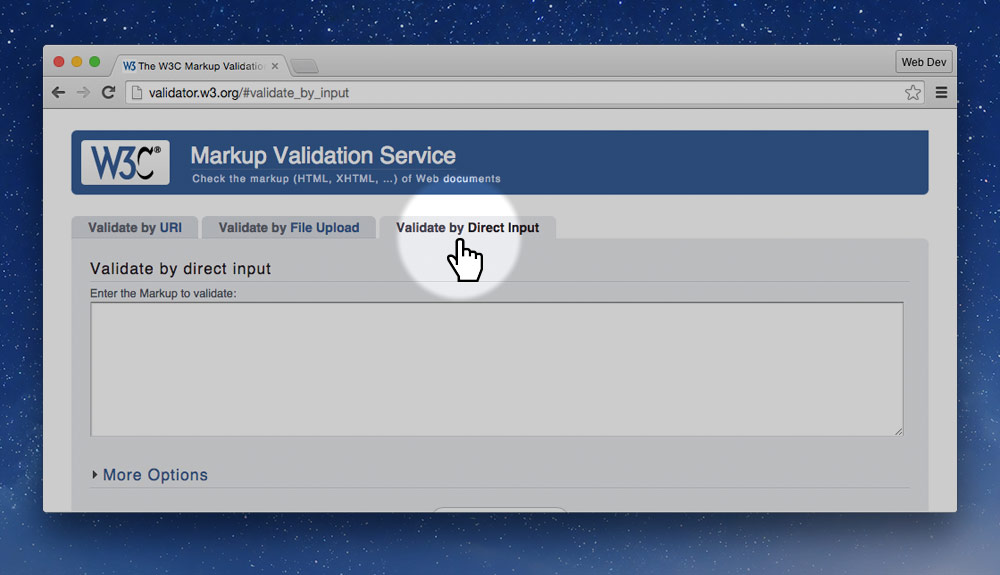
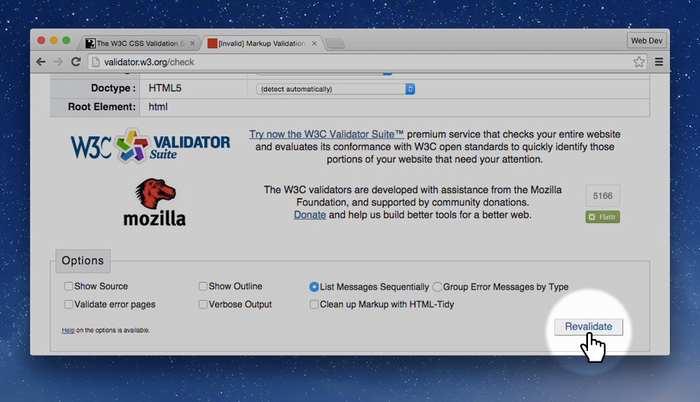
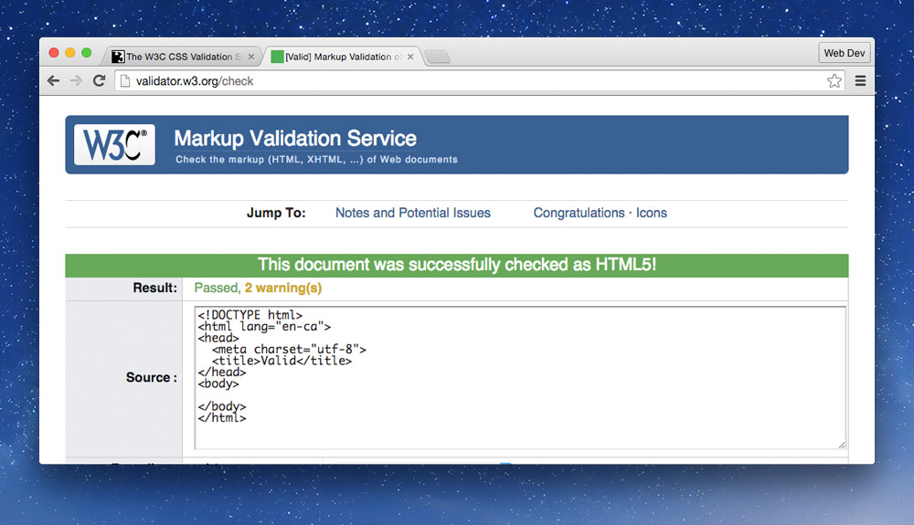
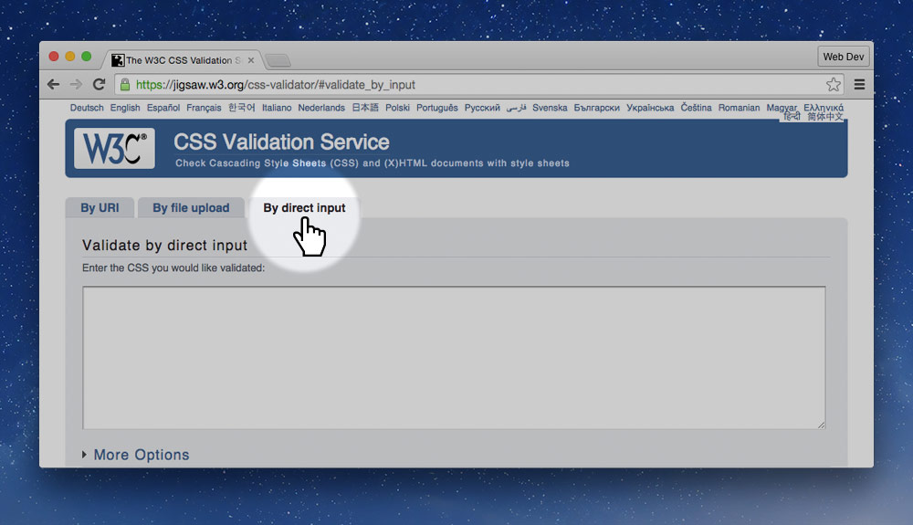

Validating our HTML, CSS, and Javascript is helpful for finding bugs as well has helping make sure it will render more consistently in all browsers.

---

## Validating HTML

Validating HTML is a good way to find errors in our code, especially if it isn’t doing what we want in the browser.

HTML validation also helps use make our websites a little more consistent between browsers.

When writing plain HTML, it’s easiest to just copy and paste the HTML into the validator.

Go to “By Direct Input” and paste your code into the box.

The validation tool should give you a report of errors—scroll down the page.

**It’s very important to solve the first error because HTML errors compond down.**

**After fixing the first error** revalidate the HTML directly on that page by pasting in the box at the top and pressing the “Revalidate” button.

If you get a green bar, everything is good to go.

### Common HTML validation errors to ignore

Sometimes you can’t quite achieve a green bar and that’s okay—but make sure you can get as close as possible.

- Ignore the two warnings: HTML conformance & UTF-8
- Ignore the Google Font Error

---

## Validating CSS

Go to “By Direct Input” and paste your code into the box.

You should be presented with the error screen next:

**Make sure to fix the top error first—the errors can cascade.**

Once your CSS is green everything is good.

### Common CSS validation errors to ignore

Sometimes you can’t quite see the green. Don’t worry, but try to solve as many problems as you can.

- Ignore the `@viewport` error codes
- The errors for `text-rendering`
- Ignore anything with vendor prefixes, like `-webkit-`, `-moz-`, etc.

---

## Validating Javascript

*[Tutorial pending…]*

---

## Video list

1. [Validation: debugging HTML and CSS](https://www.youtube.com/watch?v=79qAXqE3Qz8&index=2&list=PLWjCJDeWfDde7UgEiXizAqpQE1DDzt8RM)
2. Validation: debugging Javascript

## Supplemental links

- **[HTML validator](http://validator.w3.org/)**
- **[CSS validator](http://jigsaw.w3.org/css-validator/)**
- **[JS Hint](http://jshint.com/)**
- [JS Lint](http://jslint.com/)
