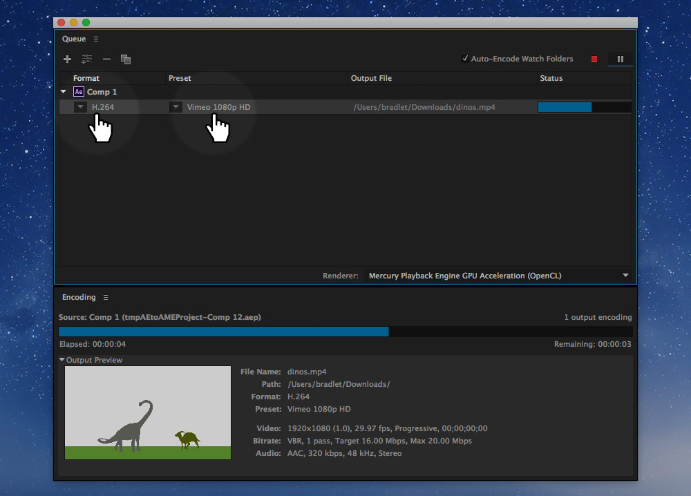
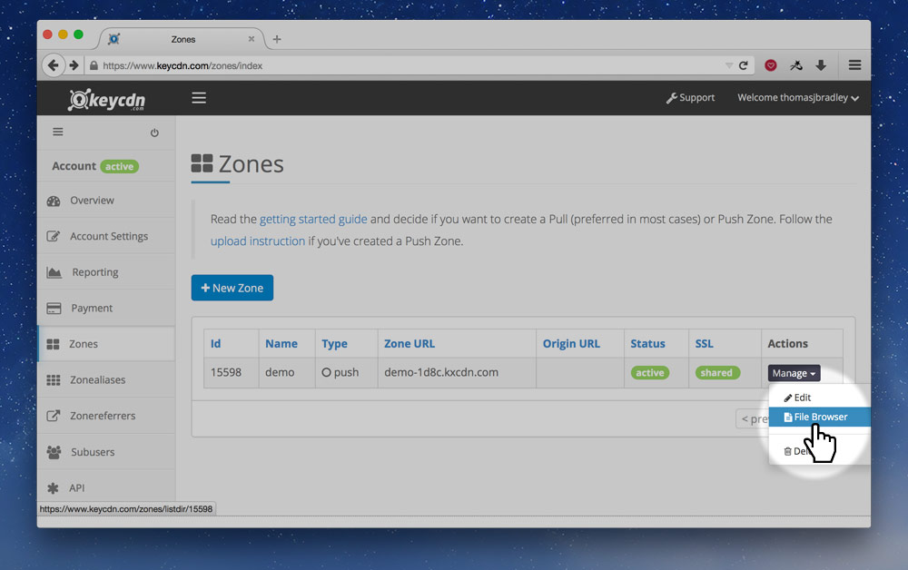
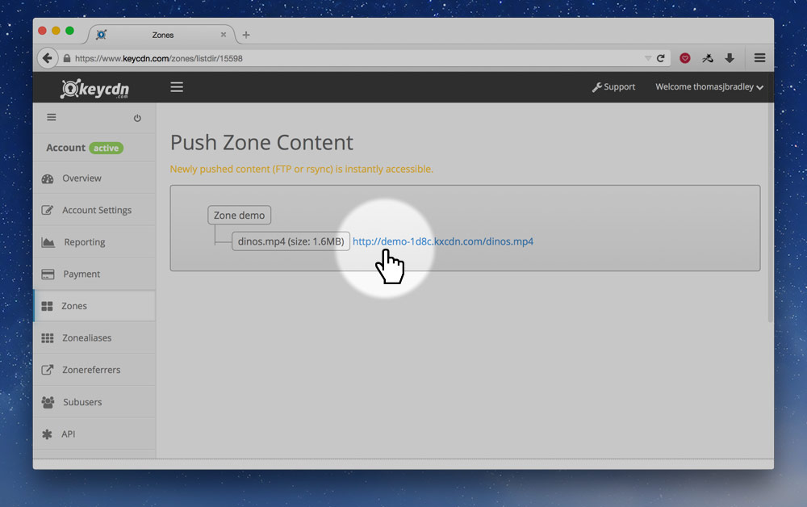

Video is extremely popular on the web, using up the majority of total bandwidth consumed.

---

## Video on the web

Historically video was difficult to do on the web: you had to provide multiple versions of the video in different formats, QuickTime, RealPlayer, Flash, etc. Flash kinda won for a while and with the advent of YouTube most video on the web was played with Flash.

HTML added a new tag, the `<video>` tag that was to remove the need for having so many different plugins and video formats. With mobile devices not supporting Flash, native video started to win.

---

## Video formats

Unfortunately, for many years we had a video format conflict, some browsers didn’t want to pay exorbitant amounts of money for [MPEG LA](https://en.wikipedia.org/wiki/MPEG_LA)’s H.264 codec and other codecs were used, including [OGG](https://en.wikipedia.org/wiki/Ogg) and [WebM](http://www.webmproject.org/).

H.264 became the dominant format anyways because it was hardware accelerated on mobile devices. Most browsers now support H.264, but many vendors are working together to come up with a patent unencumbered video codec specifically targeted at the web.

So, the benefit to us is that we really only need to provide a `.mp4` encoded in H.264 to support most browsers.

**[You can see the H.264 browser support on Can I Use.](http://caniuse.com/#feat=mpeg4)**

### Exporting from Adobe

You can use the Adobe Media Encoder to get your videos out of After Effects or Premiere Pro.



You want to output an HD 1080p H.264 video, in Adobe Media Encoder, after adding your source, choose the format and preset:

1. Format: “**H.264**”.
2. Preset: “**Vimeo 1080p HD**” or “YouTube 1080p HD”.
  *The regular “HD 1080p 29.97” should also work but may create larger file sizes.*

After the video file is created you should be left with a `.mp4` file, that’s what you need for your website.

---

## The video tag

After you have your video compressed in the right format, it’s really easy to embed it onto your website.

There are two tags we need to embed video on our website:

- `<video>` — the wrapper, with attributes to adjust functionality.
- `<source>` — used to present a video format.

A simple example of embedding a video on a website looks like this:

```html
<video src="video/dinos.mp4"></video>
```

### Fallback for video

In between the open and close `<video>` tags, you should put some fallback content, kind of like the `alt` attribute on images.

```html
<video src="video/dinos.mp4">
  Dinosaurs frolicking in the tall grass.
</video>
```

### Multiple formats

If you wanted to support more older browsers with different formats you can use multiple `<source>` tags:

```html
<video>
  <!-- Notice the `type` attribute to help the browser determine what video to play -->
  <source src="video/dinos.mp4" type="video/mp4">
  <source src="video/dinos.webm" type="video/webm">
  <source src="video/dinos.ogv" type="video/ogg">
</video>
```

### Controls

By default, there are no playback controls on a video, we need to tell the browser to add those with the `controls` attribute.

```html
<video src="video/dinos.mp4" controls>
  Dinosaurs frolicking in the tall grass.
</video>
```

The browser will then present its default set of player controls—that you cannot style.

#### Video players

If you want more access to style the controls of the video player try using a Javascript video library, or see about [making your own controls with Javascript](#using-javascript-to-control-video).

- [MediaElement.js](http://mediaelementjs.com/)
- [Video.js](http://www.videojs.com/)
- [SublimeVideo](http://www.sublimevideo.net/)
- [HTML5 Video Player Comparison](http://praegnanz.de/html5video/)

### Poster

The poster attribute allows you to specify an image that will be displayed to the user before they start playing the video. It can be in any format the browser supports, but likely you want to use JPG or PNG.

```html
<video src="video/dinos.mp4" controls poster="img/dinos-title-screen.jpg">
  Dinosaurs frolicking in the tall grass.
</video>
```

### Auto play

There is an `autoplay` attribute you can use on the video tag, it will automatically download and play the video.

Try to avoid auto playing videos—especially videos with sound. Some devices don’t even allow auto play, they require a user interaction to start a video.

*If you must auto play your video make sure to mute the sound with the `muted` attribute.*

```html
<!-- If you must auto play, make sure to add the `muted` attribute to avoid auto playing sounds. -->
<video autoplay muted>

</video>
```

### Specifying playback range

When writing in the `src` attribute of a video you can choose where the video should start and end.

We just need to add a hash onto the URL for the browser to register the range.

```html
<video src="video/dinos.mp4#t=5,20">
  Dinosaurs frolicking in the tall grass.
</video>
```

The format of the hash follows this convention:

```
#t=[starttime],[endtime]
```

Some examples:

- `#t=10,20` — start at 10 seconds, end at 20 seconds.
- `#t=,40` — start at the beginning, play until 40 seconds.
- `#t=60` — start at 60 seconds, play to the end.

You can even specify the time in `hours:minutes:seconds`:

- `#t=,2:58:00` — start at the beginning, play until 2 hours, 58 minutes in.

---

## Responsive video

You’ll most likely want to make your video flexible and scale with the dimensions of your website.

**[☛ The best way to make your video responsive is to use embed containers.](/topics/modules/)**

If your video is in the standard aspect ratio for HD of 16 by 9, your HTML will look something like this.

```html
<div class="embed embed--16by9">
  <video class="embed__item" src="video/dinos.mp4">
    Dinosaurs frolicking in the tall grass.
  </video>
</div>
```

And the CSS will look something like this:

```css
.embed {
  margin-left: 0;
  margin-right: 0;
  position: relative;
  width: 100%;
}

.embed--16by9 {
  padding-top: 56.25%;
}

.embed__item {
  height: 100%;
  left: 0;
  position: absolute;
  top: 0;
  width: 100%;
}
```

Using the above HTML & CSS will allow your video to scale while still maintaining the proper aspect ratio.

---

## Adding captions & subtitles to video

Tracks and the `<track>` tag are a standard way to provide subtitles, captions, screen reader descriptions, chapters and more for your video.

We just need to add a `<track>` element to the `<video>` tag that points to the appropriate `.vtt` file:

```html
<video src="video/dinos.mp4">
  <track src="video/subtitles.vtt" kind="subtitles" srclang="en" label="English">
  Dinosaurs frolicking in the tall grass.
</video>
```

There are a few important attributes to look at:

- `src="…"` — is a URL that points the text file for this track.
- `kind="…"` — what kind of track it is: `subtitles`, `captions`, `descriptions`, `chapters` or `metadata`.
- `srclang="…"` — the language of the content in the track.
- `label="…"` — what the user will see in the interface describing this track.

### Subtitle tracks

Subtitles are used to add transcriptions or translations to the video. They are time-based so that specific words show on the screen in time with the video.

All the tracks use the [WebVTT](http://dev.w3.org/html5/webvtt/) format, an open format for describing this type of content.

#### WebVTT

A WebVTT file is just a plain text file that you can create in your text editor—make sure to use the `.vtt` file extension when you save it.

Here’s a basic example for a subtitle track:

```vtt
WEBVTT

1
00:00:01.000 --> 00:00:10.000
Hey, how’s it going?

2
00:00:15.000 --> 00:00:20.000
Thing’s are good.
How you doin’?
```

You’ll notice a few things:

- The first line in the file must always be `WEBVTT`.
- You can add an optional heading to each entry, like `1` above.
- Next is the time code: `start --> end`.
  It’s in the format of `hours:minutes:seconds.milliseconds`, but the hours are optional.
- After the time code is the text to display, it can be written on multiple lines, but often it’s better to let the device break the lines where appropriate.

#### Styling tracks

It’s possible to style the tracks, especially subtitles and captions. Try to avoid doing too much style changes from the defaults.

Some of the basic things you can change are the following:

- `<b>` — to add bold text.
- `<i>` — to add italic text.
- `<u>` — to add underlined text.
- `<c.my-class>` — to add a class.

Some examples:

```vtt
WEBVTT

1
00:00:01.000 --> 00:00:10.000
Curse your <i>sudden</i> but <b>inevitable</b> betrayal.

2
00:00:15.000 --> 00:00:20.000
I’ve got a <c.super-bad>bad</c> feeling about this.
```

*You could then use the `.super-bad` class in CSS to style the word.*

#### Denoting the voice of the speaker

Inside the caption and subtitle tracks you can denote the voice of the person speaking. There are a few benefits to marking of the name of the voice:

1. The name of the person will be added to the display.
2. It can be read out by screen readers.
3. You can style it so each person has a different colour, etc.

Use the `<v …>` tag to denote a voice, like this:

```vtt
WEBVTT

1
00:00:01.000 --> 00:00:10.000
<v Long Neck>Hey, how’s it going?</v>

2
00:00:15.000 --> 00:00:20.000
<v Horn Head>Thing’s are good.
How you doin’?</v>
```

### Chapter tracks

Chapters allow users to jump to different sections within the video. Each chapter can be labeled however you’d like.

Here’s an example WebVTT file for chapters:

```vtt
WEBVTT

Chapter 1
00:00:00.000 --> 00:10:00.000
Dinosuars frolicking in space
```

This chapter would last from the beginning to exactly 10 minutes into the video.

**Links**

- [HTML5 Doctor: Video Subtitling and WebVTT](http://html5doctor.com/video-subtitling-and-webvtt/)
- [Getting Started With the Track Element](http://www.html5rocks.com/en/tutorials/track/basics/)
- [Wikipedia: WebVTT](https://en.wikipedia.org/wiki/WebVTT)
- [W3C: WebVTT](http://dev.w3.org/html5/webvtt/)
- [Converting SRT files to WebVTT files](http://www.webvtt.org/)

---

## Using Javascript to control video

The video (and audio) that you add to your website is completely scriptable with Javascript. What many of the video players above do is write a completely new control interface in Javascript.

Let’s start with some basic HTML for our video player:

```html
<video id="dinos" src="video/dinos.mp4">Dinosaurs frolicking in the tall grass.</video>
<button id="btn-play-pause">Play</button>
```

I’ve intentionally left the `controls` attribute off because I want to make my own play/pause control with the `<button>` tag I added.

Now let’s write some Javascript, we’ll standardize on jQuery, but it’s completely unnecessary to do any of the following functionality.

```js
// We want the raw Javascript version instead of the jQuery version
//   `document.getElementById()` is probably better
var video = $('#dinos').get(0);
var $btn = $('#btn-play-pause');

$btn.on('click', function () {
  if (video.paused) {
    video.play();
  } else {
    video.pause();
  }
});
```

There’s a bunch more you can do with Javascript and the `<video>` tag including: changing the play position, muting, changing the play speed etc.

### Javascript hover to play video

Here’s an example of how to make a video play when you hover over it and stop when you move your mouse away.

Let’s start with the HTML:

```html
<video id="me" poster="img/thomas-smiling.jpg" preload src="video/person.mp4">Thomas dancing.</video>
```

*You’ll notice I’ve added the `preload` attribute, to encourage the browser to download the video so it’s ready to play when the user interacts.*

And here’s the Javascript that should do what we want. I’ve made sure to add `focus` and `blur` for accessibility purposes.

```js
var $video = $('#me');

$video.on('mouseover focus', function () {
  $video.get(0).play();
});

$video.on('mouseout blur', function () {
  $video.get(0).pause();
});
```

**Links**

- [MDN: HTMLMediaElement](https://developer.mozilla.org/en-US/docs/Web/API/HTMLMediaElement)
- [MDN: HTMLVideoElement](https://developer.mozilla.org/en-US/docs/Web/API/HTMLVideoElement)
- [MDN: HTMLAudioElement](https://developer.mozilla.org/en-US/docs/Web/API/HTMLAudioElement)

---

## The audio tag

The `<audio>` tag is almost identical to the `<video>` tag. Here’s what a basic audio tag looks like:

```html
<audio src="audio/dino-roar.mp3" controls>
  The loud sound of a dinosaur roaring.
</audio>
```

### Audio attributes

The audio tag has many of the same attributes as the video tag, here’s a list of what you can use:

- `controls` — displays the browser’s default playback controls.
- `muted` — whether it should be audible or silent.
- `loop` — whether the sounds should be looped or not.
- `volume="…"` — to set the volume of the sound: `0.0` is silent, `1.0` is the loudest, the sounds natural volume.

### Audio formats

Currently the MP3 audio format is the most browser compatible. **[You can see the MP3 browser support on Can I Use.](http://caniuse.com/#feat=mp3)**

If you want to support older browser versions you could supply OGG also using the `<source>` tag:

```html
<audio controls>
  <source src="audio/dino-roar.mp3" type="audio/mpeg">
  <source src="audio/dino-roar.ogg" type="audio/ogg">
  The loud sound of a dinosaur roaring.
</audio>
```

### Auto play

Using the `autoplay` attribute it is possible to make sounds play automatically on your website. But…

**Don’t auto play sounds. Ever.**

Not only is it extremely annoying, but imagine how frustrating it must be for people who are trying to listen to a screen reader when all of a sudden some random sound blurts out.

---

## Hosting off GitHub

Git, and therefore GitHub, are not made for large files, like video and audio. If you accidentally sync a video into your repo you’ll probably jam it up—so just don’t put video files into your repository.

There are different solutions for where to host your video files. The quickest and easiest way is YouTube or Vimeo: bandwidth is free and they give you a complete, functional, well used & tested player, they even automatically switch between SD and HD. But the problem with YouTube & Vimeo is you have to use their player and their embed code, you also lose a lot, practically all, of the Javascript functionality.

So another solution is to use a separate host for your large files. You could use a traditional, shared host like [SiteGround](https://www.siteground.com/), or a CDN (Content Delivery Network).

**[☛ Learn more about CDNs in the advanced performance tutorial](/topics/advanced-performance/).**

### Hosting on a CDN

My suggestion would be to host your video file on a CDN, below is a tutorial using [KeyCDN](https://www.keycdn.com/), but it’s just an example.

After creating an account, create a new zone, specifically a **push zone**.


There’s a few things to fill out:

- “Zone name” — set that to whatever you want, maybe the name of your project.
- “Zone type” — set it “push”.
- Check “Show Advanced Features”.
- Set “SPDY” to “Enabled”.
- Set “SSL” to “Shared”.
- Set “Force SSL” to “Enabled”.

After you’ve created your zone, you’ll need to upload your video to the CDN, using FTPS or rsync. I like to use [Transmit](https://www.panic.com/transmit/) as my FTP application, but [Cyberduck](https://cyberduck.io/) is pretty great too. [Here’s KeyCDN’s FTP upload tutorial.](https://www.keycdn.com/support/upload-data-to-a-push-zone/)

After you’ve uploaded it’ll take a couple minutes for your video to sync around the world on all their servers.

But you should now have a URL to the video, to get the URL, the file browser is a simple way.



On your zone listing page, click the “Manage” menu and select “File Browser”.



On the next screen you should see your filename. *Note that it isn’t using **HTTPS**, so you’ll have to change that because we changed the setting above to “Force SSL”.*

Now that you have your URL, you can change the `<video>` tag’s `src` attribute to the new location:

```html
<video src="http://demo-1d8c.kxcdn.com/dinos.mp4">Dinosaurs frolicking in the tall grass.</video>
```

That’s all. **But make sure never to put large files like video and audio into your Git/GitHub repository.**

**Links**

- **[KeyCDN](https://www.keycdn.com/)** — [Upload data to push zone](https://www.keycdn.com/support/upload-data-to-a-push-zone/)
- [Amazon S3](https://aws.amazon.com/s3/)
- [MaxCDN](http://www.maxcdn.com/)
- [Wistia](http://wistia.com/)

---

## Video list

1. Video & audio: video formats
2. Video & audio: video tag
3. Video & audio: responsive video
4. Video & audio: adding tracks to video
5. Video & audio: using Javascript to control video
6. Video & audio: Javascript hover to play video
7. Video & audio: hosting off GitHub
8. Video & audio: audio tag

## Supplemental links

- [Wikipedia: HTML5 video](https://en.wikipedia.org/wiki/HTML5_video)
- [MDN: Using HTML5 audio and video](https://developer.mozilla.org/en-US/docs/Web/Guide/HTML/Using_HTML5_audio_and_video)
- [HTML5 Video](http://www.html5rocks.com/en/tutorials/video/basics/)
- [W3C: Media Fragments](http://www.w3.org/TR/media-frags/)
- [Dive Into HTML5: Video](http://diveintohtml5.info/video.html)
